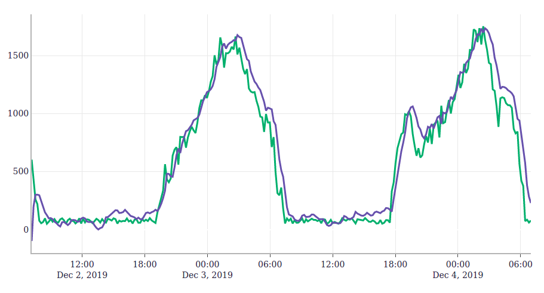

[<Back to TOC](../README.md)
# MindsDB Time Series - Mall Traffic

Here you will find a file [mall_traffic.csv](https://raw.githubusercontent.com/mindsdb/mindsdb/master/docs/examples/time_series/mall_traffic/mall_traffic.csv), containing synthetic data for the number of people inside a small commercial center during the course of one week. Measurements are roughly 10 minutes apart.

### Goal
The goal is to be able to predict the mall traffic, given the past hour of historical data.

#### Learning

```python

from mindsdb_native import Predictor

mdb = Predictor(name='mall_traffic')

mdb.learn(
    from_data=train_data,
    to_predict='people_count',
    timeseries_settings={
        'order_by': ['TimeStamp'],
        'window': 6,  # one hour of historical data
        'use_previous_target': True
        }
)

```

In this case, MindsDB will predict the people count by considering previous measurements of this quantity. This is signaled by the `use_previous_target: True` argument.

#### Predicting

To make a prediction, you can now pass a DataFrame with the last x hours of readings.

For simplicity we use a file.

Here you will find a file [mall_traffic_predict.csv](https://raw.githubusercontent.com/mindsdb/mindsdb/master/docs/examples/time_series/mall_traffic/mall_traffic_predict.csv), containing data for the last couple of days that we want to forecast.


```python
# Here we use the model to make predictions
forecast = mdb.predict(when_data='mall_traffic_predict.csv')
```

## Notes
You need to install the `plotly` plotting package in your python environment (`pip install plotly`), so that when running the `train.py` script you get an interactive graph of the predictions:




#### About the Learning

Note: that the argument **from_data** can be a pandas DataFrame, a path to a file or a URL
